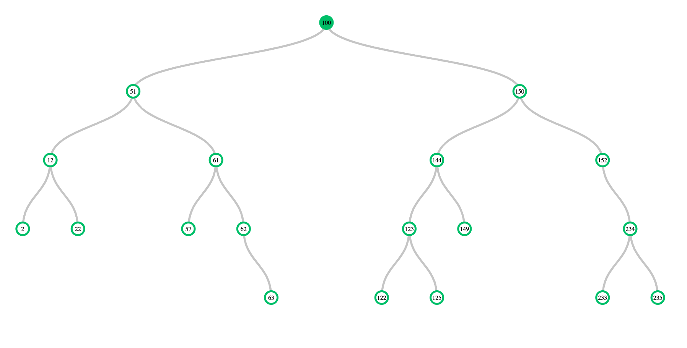

#


<h1 align="center"> Tree Visualizer 👋</h1>
<p align="center">
  <a href="https://github.com/seydobassam/tree-visualizer#readme#options" target="_blank">
    
  </a>
  <a href="http://www.typescriptlang.org/" target="_blank">
    
  </a>
  <a href="https://github.com/seydobassam/tree-visualizer/issues" target="_blank">
    
  </a>
  <a href="https://github.com/seydobassam/binary-tree/blob/master/LICENSE" target="_blank">
    
  </a>
</p>
<p align="center"> 
  
<p/>

## About

A Reactive Binary tree visualizer that can visualize a Binary search tree, the library has the Binary search tree data structure out of the box, it can be used and the binaryTreeDrawer function can draw it via d3.  The library supports a lot of options such as animation and styling via CSS classes, click nodes, as well as zoom the tree in and out, and many more ...

## Documentation

### Installation

```sh
# NPM
npm install tree-visualizer
```

### Usage

The HTML where the Binary Search tree will be rendered

```html
<!DOCTYPE html>
<html lang="en">
  <body>
    <div id="binarySearchTree"></div>
    // Import the Typescript/Javascript code. For this example, it is located in the index.ts file.
    <script type="module" src="./index.ts"></script>
  </body>
</html>

```

Create BinarySearchTree data Structure and then draw it via  `draw()` function.

```ts
import { BinaryTree, binaryTreeDrawer } from "tree-visualizer";

let bst: BinaryTree<number> = new BinaryTree<number>(100);
bst.addNode(51);
bst.addNode(150);
bst.addNode(12);
bst.addNode(152);
bst.addNode(2);
bst.addNode(144);
bst.addNode(12);
bst.addNode(61);
bst.addNode(62);
bst.addNode(63);
bst.addNode(234);
bst.addNode(22);
bst.addNode(123);
bst.addNode(122);
bst.addNode(125);
bst.addNode(57);
bst.addNode(233);
bst.addNode(235);
bst.addNode(149);

// Draw the Binary Search Tree by giving the draw function the Element Id where the Binary Search tree will render 
// and then the created Binary Search data structure.
binaryTreeDrawer().draw("#binarySearchTree", bst);
```
## Author

👤 **Bassam/Martin Seydo**

- Github: [@BassamSeydo](https://github.com/seydobassam)
- LinkedIn: [@BassamSeydo](https://linkedin.com/in/bassam-seydo-3a887a150/)

## Show your support

Give a ⭐️ if this project helped you!

## 📝 License

Copyright © 2022 [Bassam/Martin Seydo] (https://github.com/seydobassam).<br />
This project is  [MIT](https://github.com/seydobassam/tree-visualizer/blob/master/LICENSE). licensed.